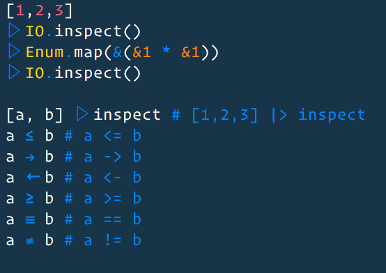

## Description

Use Vim 7.3 Conceal feature to display unicode operators
in Elixir without changing the underlying file.

Easy to use the same approach to override others

GitHub: https://github.com/arcseldon/vim-elixirConceal

## Installation

Decompress in your ~/vimfiles or ~/.vim, if you're using
pathogen / vundle then (you should), put it in ~/.vim/bundle/elixirConceal
folder.

[Vundle](https://github.com/VundleVim/Vundle.vim) - add:

Bundle 'arcseldon/vim-elixirConceal'

:PluginInstall

## Disable Option

If you wish to disable usage whilst installed, just add

let g:no_elixir_conceal = 1

to your .vimrc

## Update 30/01/2018

Sneaked Elm support into this plugin.

If you wish to disable usage whilst installed, just add

let g:no_elm_conceal = 1

to your .vimrc

## Credits

This repo is heavily inspired by:

- https://github.com/Twinside/vim-haskellConceal
- https://github.com/ehamberg/vim-cute-python
